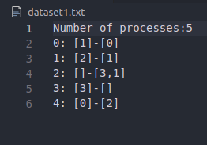

# RaymondsAlgorithm

Author: Facundo Agustin Rodriguez


### Recomendation
I recomend using a .md previewer,
In vscode you can use the integrated previewer with the key combination (Ctrl + Shft + V)

## Dataset
First line must contain "Number of processes:" immediately followed by a integer value ex."Number of processes:7".
From the second line on, each line will represent a process, identified by an integer, followed by two arrays
The first arrais contains the resources alocated to that particular process, the second array contains the resources the process is requesting for.
Heres an example of how a dataset would look like. 



The first dataset contains a deadlock, the second one does not.

## Execution

We will execute the programm passing the dataset as argument

```shell
javac HoRamamurthy.java
java HoRamamurthy.java dataset1.txt
```

The expected output for this dataset is the following:
```output
Procces 0 is locked due to a cycle
Procces 1 is locked due to a cycle
Procces 2 is locked due to a cycle
Procces 4 is locked due to a cycle
```